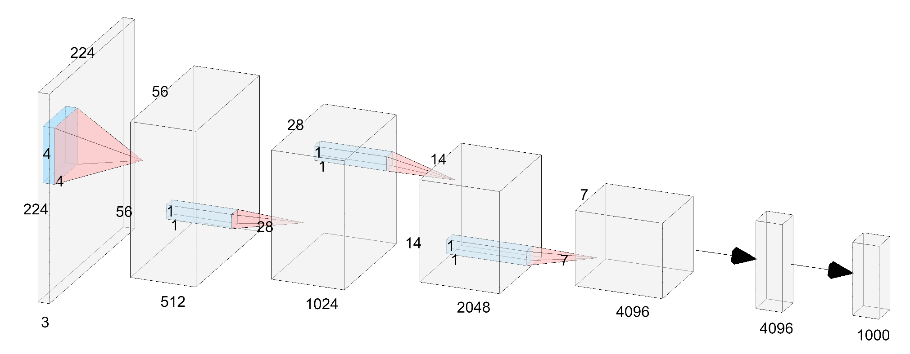
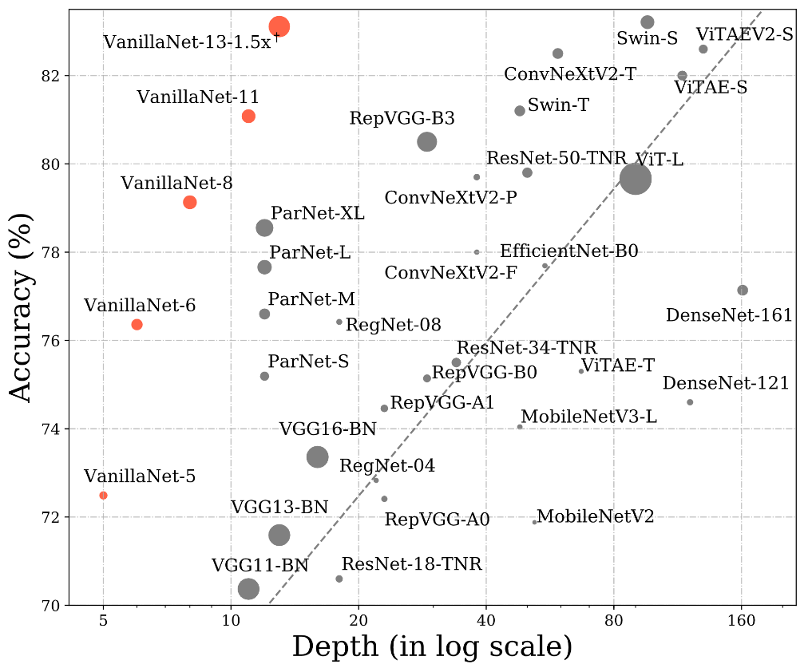
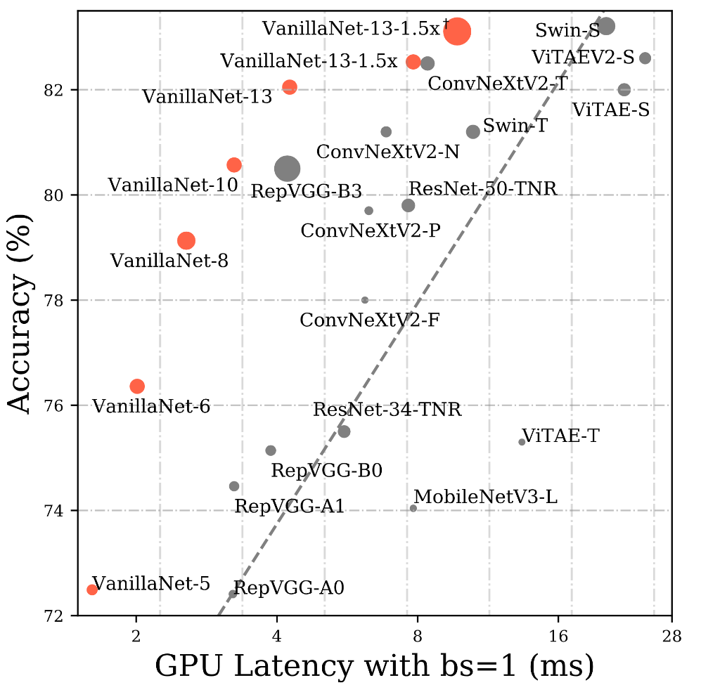

# VanillaNet: the Power of Minimalism in Deep Learning 
<p align="left">
<a href="https://arxiv.org/abs/2305.12972" alt="arXiv">
    </a>
</p>


Official PyTorch implementation of **VanillaNet**, from the following paper:\
[VanillaNet: the Power of Minimalism in Deep Learning ](https://arxiv.org/abs/2305.12972)\
Hanting chen, [Yunhe Wang](https://www.wangyunhe.site/), Jianyuan Guo and Dacheng Tao



VanillaNet is an innovative neural network architecture that focuses on **simplicity** and **efficiency**. Moving away from complex features such as **shortcuts** and **attention** mechanisms, VanillaNet uses a reduced number of layers while still **maintaining excellent performance**. This project showcases that it's possible to achieve effective results with a lean architecture, thereby setting a new path in the field of computer vision and challenging the status quo of foundation models. 

## Comparison of Depth and Speed

 

VanillaNet achieves comparable performance to prevalent computer vision foundation models, yet boasts a **reduced depth and enhanced inference speed**:
- **9-layers'** VanillaNet achieves about **80%** Top-1 accuracy with **3.59ms**, over **100%** speed increase compared to ResNet-50 (**7.64ms**).
- **13 layers'** VanillaNet achieves about **83%** Top-1 accuracy with **9.72ms**, over **100%** speed increase compared to Swin-T (**20.25ms**).

## Downstream Tasks
| Framework | Backbone | FLOPs(G) | #params(M) | FPS | AP<sup>b</sup> | AP<sup>m</sup> |
|:---:|:---:|:---:|:---:| :---:|:---:|:---:|
| RetinaNet | Swin-T | 245 | 38.5 | 27.5 | 41.5 | - |
|  | VanillaNet-13 | 397 | 74.6 | 29.8 | 41.8 | - |
| Mask RCNN | [Swin-T](https://github.com/open-mmlab/mmdetection/tree/main/configs/swin) | 267 | 47.8 | 28.2 | 42.7 | 39.3 |
|  | VanillaNet-13 | 421 | 76.3 | 32.6 | 42.9 | 39.6 |


VanillaNet achieves a higher Frames Per Second (FPS) in **detection** and **segmentation** tasks.


## Catalog
- [x] ImageNet-1K Testing Code  
- [x] ImageNet-1K Training Code of VanillaNet-5 to VanillaNet-10  
- [x] ImageNet-1K Pretrained Weights of VanillaNet-5 to VanillaNet-10
- [ ] ImageNet-1K Training Code of VanillaNet-11 to VanillaNet-13
- [ ] ImageNet-1K Pretrained Weights of VanillaNet-11 to VanillaNet-13
- [ ] Downstream Transfer (Detection, Segmentation) Code

## Results and Pre-trained Models
### ImageNet-1K trained models

| name | #params(M) | FLOPs(B) | Lacency(ms) | Acc(%) | model |
|:---:|:---:|:---:|:---:| :---:|:---:|
| VanillaNet-5 | 15.5 | 5.2 | 1.61 | 72.49 | [model](https://drive.google.com/file/d/1yqTxU7zpaE-XhFeVFq1TbmBmMSfhTKcR/view?usp=sharing) |
| VanillaNet-6 | 32.5 | 6.0 | 2.01 | 76.36 | [model](https://drive.google.com/file/d/128ZGebHeDxWbUlLD24HfDUBUHOVTMNX6/view?usp=sharing) |
| VanillaNet-7 | 32.8 | 6.9 | 2.27 | 77.98 | [model](https://drive.google.com/file/d/184kFuTZFRo3hFUQ8-sqSETebD3j3vK_v/view?usp=sharing) |
| VanillaNet-8 | 37.1 | 7.7 | 2.56 | 79.13 | [model](https://drive.google.com/file/d/1XNhe2LcNMjNZqBysGNvZLSsbKTrqWTw7/view?usp=sharing) |
| VanillaNet-9 | 41.4 | 8.6 | 2.91 | 79.87 | [model](https://drive.google.com/file/d/1DKifDZR5FqrEr7ICLPzuniQzu03hnnF_/view?usp=sharing) |
| VanillaNet-10 | 45.7 | 9.4 | 3.24 | 80.57 | [model](https://drive.google.com/file/d/1JskZU6otH_6NVXJHNe-74pEaZRVPxXlP/view?usp=sharing) |
| VanillaNet-11 | 50.0 | 10.3 | 3.59 | 81.08 | - |
| VanillaNet-12 | 54.3 | 11.1 | 3.82 | 81.55 | - |
| VanillaNet-13 | 58.6 | 11.9 | 4.26 | 82.05 | - |
| VanillaNet-13-1.5x | 127.8 | 26.5 | 7.83 | 82.53 | - |
| VanillaNet-13-1.5x&dagger; | 127.8 | 48.9 | 9.72 | 83.11 | - |

## Installation

The results are produced with `torch==1.10.2+cu113 torchvision==0.11.3+cu113 timm==0.6.12`. Other versions might also work.

Install [Pytorch](https://pytorch.org/) and, [torchvision](https://pytorch.org/vision/stable/index.html) following official instructions.

Install required packages:
```
pip install timm==0.6.12
pip install cupy-cuda113
pip install torchprofile
pip install einops
pip install tensorboardX
pip install terminaltables
```

## Dataset Preparation

Download the [ImageNet-1K](http://image-net.org/) classification dataset and structure the data as follows:
```
/path/to/imagenet-1k/
  train/
    class1/
      img1.jpeg
    class2/
      img2.jpeg
  val/
    class1/
      img3.jpeg
    class2/
      img4.jpeg
```

For pre-training on [ImageNet-22K](http://image-net.org/), download the dataset and structure the data as follows:
```
/path/to/imagenet-22k/
  class1/
    img1.jpeg
  class2/
    img2.jpeg
  class3/
    img3.jpeg
  class4/
    img4.jpeg
```

## Testing

We give an example evaluation command  for VanillaNet-5:

without deploy:

```
python -m torch.distributed.launch --nproc_per_node=1 main.py --model vanillanet_5 --data_path /path/to/imagenet-1k/ --real_labels /path/to/imagenet_real_labels.json --finetune /path/to/vanillanet_5.pth --eval True --model_key model_ema --crop_pct 0.875
```

with deploy:
```
python -m torch.distributed.launch --nproc_per_node=1 main.py --model vanillanet_5 --data_path /path/to/imagenet-1k/ --real_labels /path/to/imagenet_real_labels.json --finetune /path/to/vanillanet_5.pth --eval True --model_key model_ema --crop_pct 0.875 --switch_to_deploy /path/to/vanillanet_5_deploy.pth
```

## Training

You can use the following command to train VanillaNet-5 on a single machine with 8 GPUs: 
```
python -m torch.distributed.launch --nproc_per_node=8 main.py \
--model vanillanet_5 \
--data_path /path/to/imagenet-1k \
--batch_size 128 --update_freq 1  --epochs 300 --decay_epochs 100 \ 
--lr 3.5e-3 --weight_decay 0.35  --drop 0.05 \
--opt lamb --aa rand-m7-mstd0.5-inc1 --mixup 0.1 --bce_loss \
--output_dir /path/to/save_results \
--model_ema true --model_ema_eval true --model_ema_decay 0.99996 \
--use_amp true 
```

- Here, the effective batch size = `--nproc_per_node` * `--batch_size` * `--update_freq`. In the example above, the effective batch size is `8*128*1 = 1024`.

To train other VanillaNet variants, `--model` need to be changed. Examples are given below.

<details>
<summary>
VanillaNet-6
</summary>

```
python -m torch.distributed.launch --nproc_per_node=8 main.py \
--model vanillanet_6 \
--data_path /path/to/imagenet-1k \
--batch_size 128 --update_freq 1  --epochs 300 --decay_epochs 100 \ 
--lr 4.8e-3 --weight_decay 0.32  --drop 0.05 \
--layer_decay 0.8 --layer_decay_num_layers 4 \
--opt lamb --aa rand-m7-mstd0.5-inc1 --mixup 0.15 --bce_loss \
--output_dir /path/to/save_results \
--model_ema true --model_ema_eval true --model_ema_decay 0.99996 \
--use_amp true 
```
</details>

<details>
<summary>
VanillaNet-7
</summary>

```
python -m torch.distributed.launch --nproc_per_node=8 main.py \
--model vanillanet_7 \
--data_path /path/to/imagenet-1k \
--batch_size 128 --update_freq 1  --epochs 300 --decay_epochs 100 \ 
--lr 4.7e-3 --weight_decay 0.35  --drop 0.05 \
--layer_decay 0.8 --layer_decay_num_layers 5 \
--opt lamb --aa rand-m7-mstd0.5-inc1 --mixup 0.4 --bce_loss \
--output_dir /path/to/save_results \
--model_ema true --model_ema_eval true --model_ema_decay 0.99996 \
--use_amp true 
```
</details>

<details>
<summary>
VanillaNet-8
</summary>

```
python -m torch.distributed.launch --nproc_per_node=8 main.py \
--model vanillanet_8 \
--data_path /path/to/imagenet-1k \
--batch_size 128 --update_freq 1  --epochs 300 --decay_epochs 100 \ 
--lr 3.5e-3 --weight_decay 0.3  --drop 0.05 \
--opt lamb --aa rand-m7-mstd0.5-inc1 --mixup 0.4 --bce_loss \
--output_dir /path/to/save_results \
--model_ema true --model_ema_eval true --model_ema_decay 0.99996 \
--use_amp true 
```
</details>

<details>
<summary>
VanillaNet-9
</summary>

```
python -m torch.distributed.launch --nproc_per_node=8 main.py \
--model vanillanet_9 \
--data_path /path/to/imagenet-1k \
--batch_size 128 --update_freq 1  --epochs 300 --decay_epochs 100 \ 
--lr 3.5e-3 --weight_decay 0.3  --drop 0.05 \
--opt lamb --aa rand-m7-mstd0.5-inc1 --mixup 0.4 --bce_loss \
--output_dir /path/to/save_results \
--model_ema true --model_ema_eval true --model_ema_decay 0.99996 \
--use_amp true 
```
</details>

<details>
<summary>
VanillaNet-10
</summary>

```
python -m torch.distributed.launch --nproc_per_node=8 main.py \
--model vanillanet_10 \
--data_path /path/to/imagenet-1k \
--batch_size 128 --update_freq 1  --epochs 300 --decay_epochs 100 \ 
--lr 3.5e-3 --weight_decay 0.25  --drop 0.05 \
--opt lamb --aa rand-m7-mstd0.5-inc1 --mixup 0.4 --bce_loss \
--output_dir /path/to/save_results \
--model_ema true --model_ema_eval true --model_ema_decay 0.99996 \
--use_amp true 
```
</details>


### Acknowledgement

This repository is built using the [timm](https://github.com/rwightman/pytorch-image-models) library, [DeiT](https://github.com/facebookresearch/deit), [BEiT](https://github.com/microsoft/unilm/tree/master/beit), [RegVGG](https://github.com/DingXiaoH/RepVGG), and [ConvNeXt](https://github.com/facebookresearch/ConvNeXt) repositories.

### License
This project is released under the MIT license. Please see the [LICENSE](License) file for more information.

### Citation
If our work is useful for your research, please consider citing:
```
@article{chen2023vanillanet,
  title={VanillaNet: the Power of Minimalism in Deep Learning},
  author={Chen, Hanting and Wang, Yunhe and Guo, Jianyuan and Tao, Dacheng},
  journal={arXiv preprint arXiv:2305.12972},
  year={2023}
}
```
